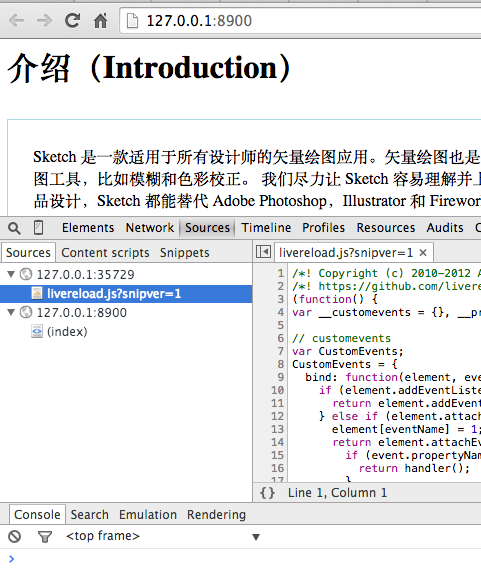

# [gulp](http://gulpjs.com)-markdown-livereload [](https://travis-ci.org/sindresorhus/gulp-markdown)

> Markdown to HTML with [marked](https://github.com/chjj/marked)

*Issues with the output should be reported on the marked [issue tracker](https://github.com/chjj/marked/issues).*


## Livereload




http://feedback.livereload.com/knowledgebase/articles/86180-how-do-i-add-the-script-tag-manually-

## Install

```sh
$ npm install --save-dev gulp-markdown-livereload
```


## Usage

```js
var gulp = require('gulp');
var markdown = require('gulp-markdown-livereload');

gulp.task('default', function () {
	return gulp.src('intro.md')
		.pipe(markdown())
		.pipe(gulp.dest('dist'));
});
```


## API

### markdown(options)

See the marked [options](https://github.com/chjj/marked#options-1).

## History

- v0.1.0
	- init


## License

MIT © [alfred sang](http://no320.com)
